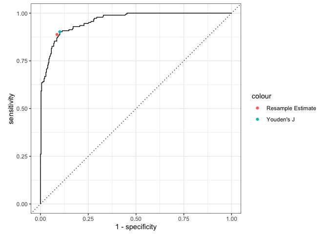

# thresholdr

The goal of thresholdr is to estimate optimal probability thresholds for
determining classifications when the true state is unknown, such as when
using diagnostic classification models.

## Installation

You can install the development version of thresholdr like so:

``` r

# install.packages("remotes")
remotes::install_github("r-dcm/thresholdr")
```

## Example usage

There the true classifications are known, we can determine the optimal
threshold using a supported method, such as Youden’s J statistic. For
example, using simulated data where the true attribute classifications
are known, we can calculate the optimal probability classification
threshold using
[`calc_youden()`](https://thresholdr.r-dcm.org/reference/calc_youden.md):

``` r

library(thresholdr)

calc_youden(estimates = dcm_probs$att1$estimate,
            truth = dcm_probs$att1$truth)
#> [1] 0.3170266
```

However, in practice the true attribute classifications are unknown. In
this scenario, we can estimate what the optimal threshold should be
using, for example, resampling:

``` r

optimal_resample(estimates = dcm_probs$att1$estimate, optimal_method = "youden")
#> # A tibble: 1 × 4
#>   .threshold  sensitivity   specificity      j_index
#>        <dbl>   <rvar[1d]>    <rvar[1d]>   <rvar[1d]>
#> 1      0.381  0.89 ± 0.02  0.91 ± 0.012  0.8 ± 0.025
```

This results in a threshold that is similar, although slightly higher,
than what we know the true optimal threshold should be. We can also
visualize our estimate on an ROC curve. Here again we see that our
estimated optimal threshold from the resamples are very close to the
true value.


